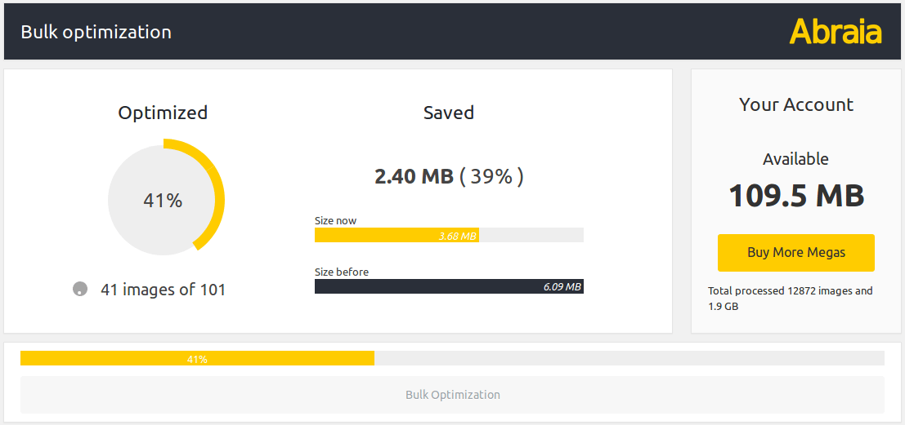
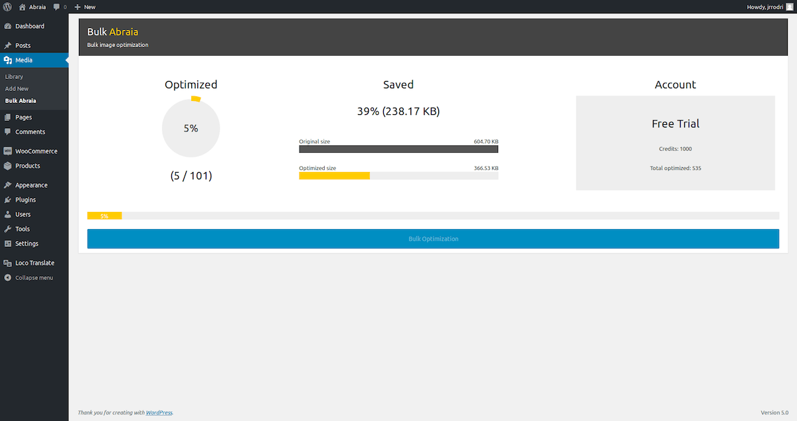
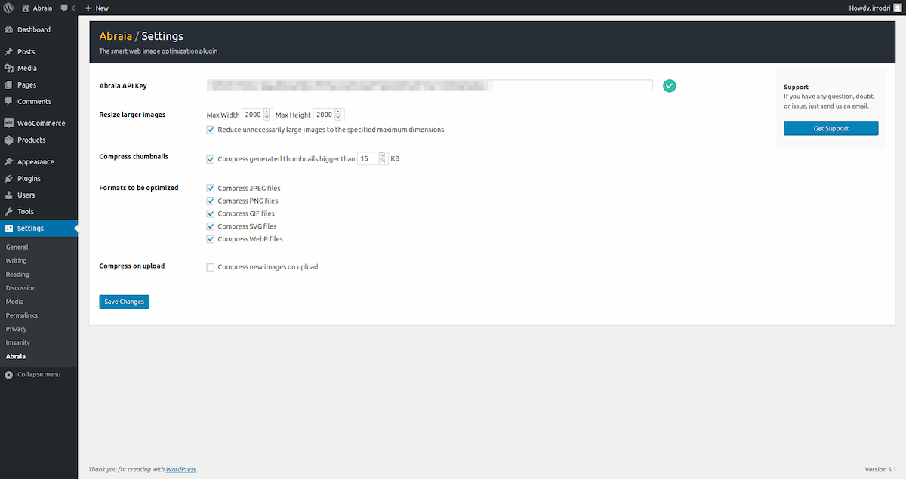

# Abraia image optimization plugin for WordPress

Automatically optimize all the images and animations in your WordPress, and 
speed up your site for any device with a perfect balance between quality and 
file size.

## Description

Compress all the images and animations (JPEG, PNG, GIF, SVG, and WebP) in your 
Wordpress and Woocomerce site with the best parameters for each image based on 
its contain. It integrates the [Abraia service](https://abraia.me) to provide 
the best in class [image optimization](https://abraia.me/docs/image-optimization)
technology.

### Features

- Optimize all your images in one click.
- Optimize your images using advanced content-aware technology.
- Process JPEG, PNG, GIF, SVG, and WebP image files.
- Automatically scale large images in your media library.
- Integrated cloud backup with no additional cost.
- Manually optimize images in the media library.
- Automatically optimize images on upload.

Install the [Abraia WordPress plugin](
https://github.com/abraia/abraia-wordpress/archive/v0.6.2.zip) now and [start
optimizing images for free](https://abraia.me/docs/getting-started).

## Installation

1. Download the [last version of the plugin](
https://github.com/abraia/abraia-wordpress/archive/v0.6.2.zip).
2. Install it via Plugins > Add New > Upload Plugin.
3. Activate it and configure your API Key to get everything working.

## Bulk optimization

Go to the media library and select `Bulk Abraia` to automatically optimize all
your images.

## Manual optimization

Also, you can manually optimize every JPEG, PNG, GIF, SVG, and WebP image from
the right column in the `Media Library` grid mode. Just press the individual
`optimize` button or select several images to compress them with the bulk
option.

You can also restore the original image pressing the `restore` button.

## Plugin settings

Images larger than 2000x2000 pixels are resized by default. You can change this
size in the Abraia settings page. Moreover, there is an additional option to
optimize images on upload.

We take care of your web images applying perception metrics to find the best
image optimization parameters for every image.

## Contact us

Got questions or feedback? Let us know! Contact us at
[contact@abraiasoftware.com](mailto:contact@abraiasoftware.com).

## License

This software is licensed under the GPLv2 License. [View the license](LICENSE).
