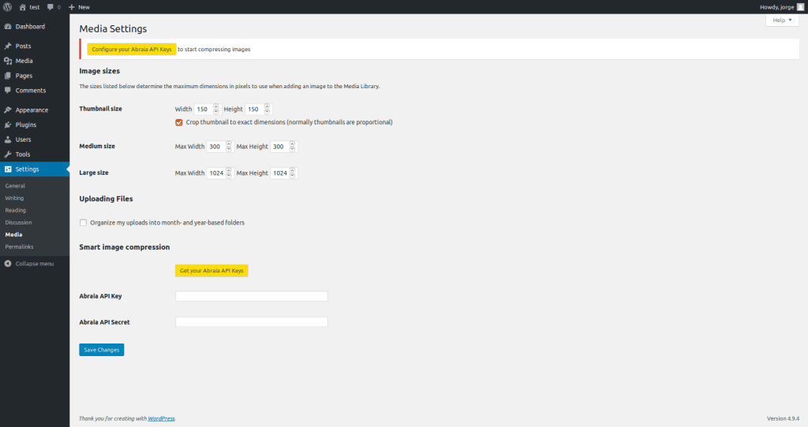
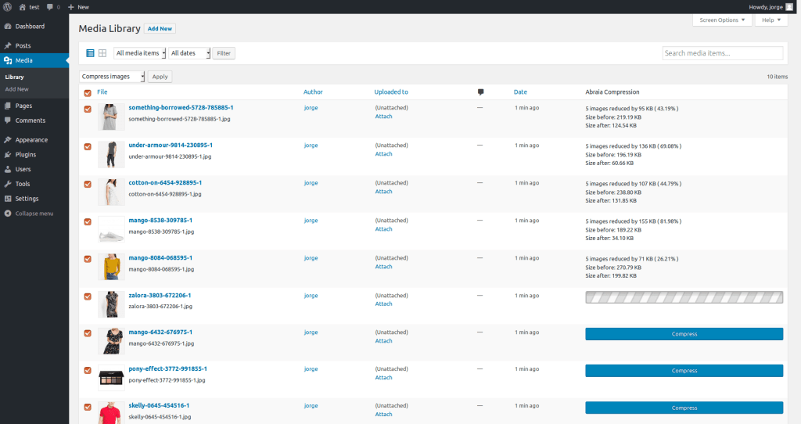
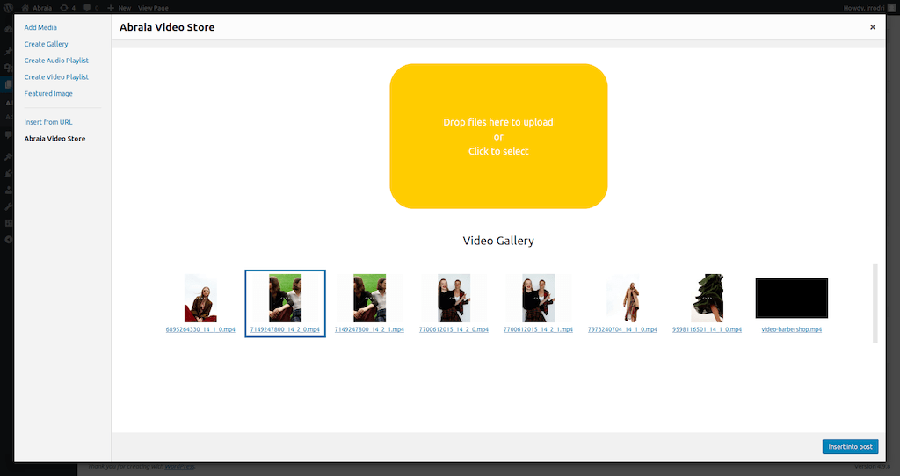

# Abraia image and video optimization plugin for WordPress

This plugin automatically optimizes your images and videos for any device with
an optimal balance between quality and file size. It integrates the [Abraia
services](https://abraia.me) in your WordPress or Woocommerce site, making easy
to speed up your web site optimizing all your images and videos.

## Installation

Just:

1. Download the last version of the plugin from [here](
https://github.com/abraia/abraia-wordpress/releases).
2. Install it via Plugins > Add New > Upload Plugin.
3. Activate it and configure your API Keys to get everything
working.

## Use

Go to the media library, select the grid mode and automatically optimize
every JPEG and PNG image from the right column pressing the button or select
several images and compress them with the bulk option.

Moreover, you can directly embed your responsive videos, optimized for any
device (from desktop to mobile), just uploading and selecting the video.

## Contact us

Got questions or feedback? Let us know! Contact us at
[contact@abraiasoftware.com](mailto:contact@abraiasoftware.com).

## License

This software is licensed under the GPLv2 License. [View the license](LICENSE).
