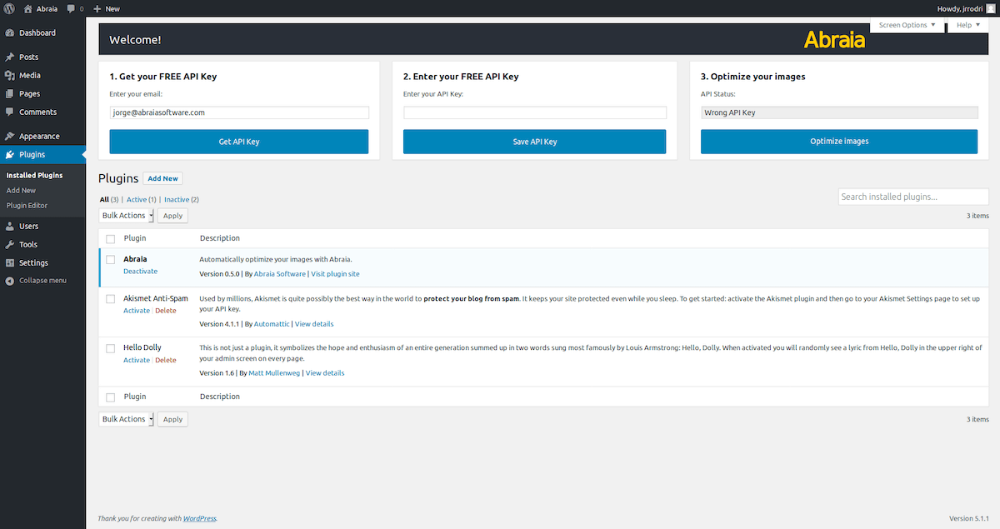
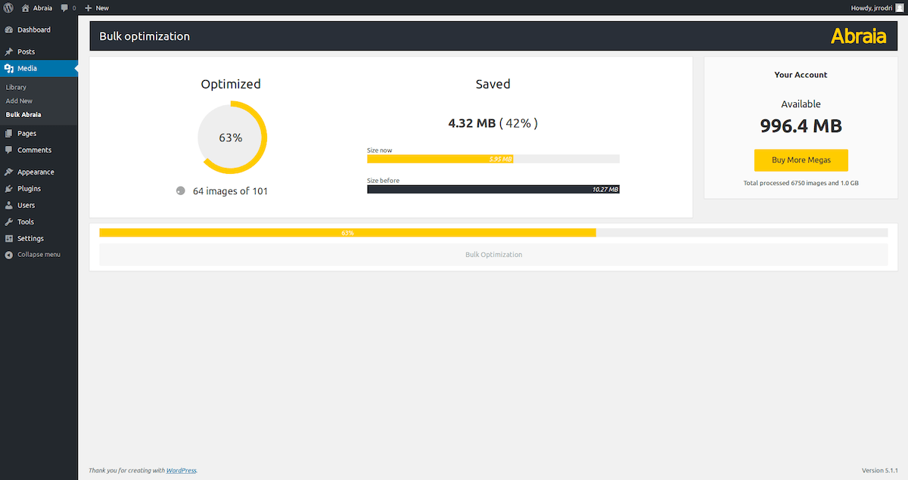
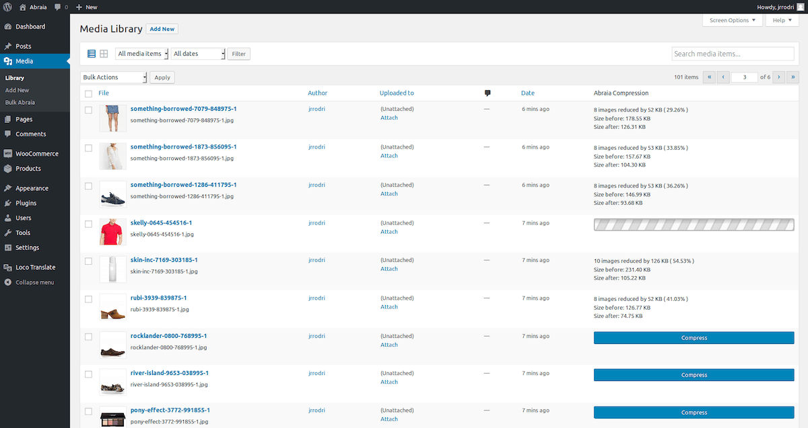
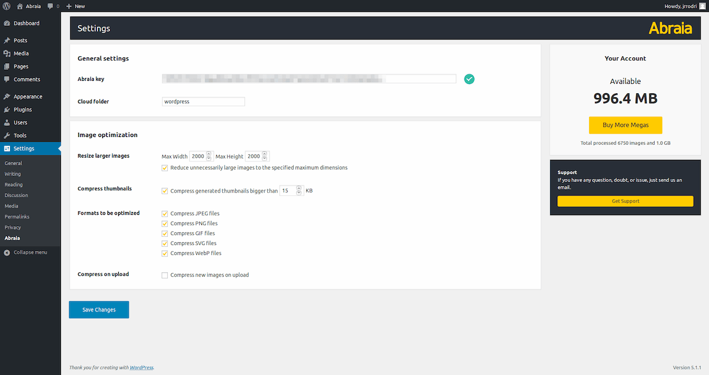

<!--
  Title: Bulk optimize images with Abraia WordPress plugin
  Description: Built for performant ecommerce images, seamlessly optimize your images with the best quality and minimum file size.
  Author: Abraia Software
  -->

# Abraia image optimization plugin for WordPress

Tailor-made for best ecommerce image optimization the [Abraia](https://abraia.me) Wordpress plugin provides a cost effective (you only pay what you need, no month subscription) solution. It automatically optimize all your Wordpress and Woocomerce images and animations (JPEG, PNG, GIF, SVG, and WebP) to speed up your website preserving the best visual quality.

Based on best in class [image optimization](https://abraia.me/docs/image-optimization/) technology. It analyzes each image to find and adjust each image compression parameters, providing a perfect balance between image quality and file size.

## Abraia Wordpress plugin features

- Bulk image optimization (optimize all your images in one click).
- Optimize your images using advanced content-aware technology.
- Perfectly compress JPEG, PNG, GIF, SVG, and WebP image files.
- Automatically resize and compress large images.
- Integrated cloud backup with no additional cost (15 days).
- Manually optimize images in the media library.
- Automatically optimize images on upload.

## Abaia Wordpress plugin installation

1. Download the [last version of the plugin](https://github.com/abraia/abraia-wordpress/archive/v1.0.zip).
2. Install it via Plugins > Add New > Upload Plugin.
3. Activate it and configure your API Key to start optimizing.

*Abraia for WordPress welcome message*

If you don't have an API Key, click the `Get API Key` button from the welcome message and create your account to get your FREE API key. Then, copy and paste it in the input box.

## Bulk optimize wordpress images

To start optimizing all your images in your Wordpress, go to the
`Bulk Abraia` page in the `Media section`, and click the `Bulk optimization` button to automatically optimize all your images in the media library.

*Abraia for WordPress bulk optimization*

## Manual optimization and restore

You can also manually optimize every JPEG, PNG, GIF, SVG, and WebP image from the `Media Library`. Choosing the `grid mode` use the `Optimize` button in the `Abraia Compression` column to compress individual images.

*Abraia for WordPress media libray optimization*

Once compressed, the optimization button is replaced with the savings statistics and the restore button. You can restore your original images, stored in the cloud, pressing the `Restore` button.

You can also select several images from the left column and compress then with the bulk option in the select box.

## Multisite configuration and settings

You can use the same account in as many sites as you wish. Just remember to configure the backup folder name in the `Abraia settings` page to preserve backups, without overwriting images with the same name.

*Abraia for WordPress settings page*

The plugin automatically resizes larger images images than a given resolution (2000x2000 by default). This resolution can be easily changed in the settings page.

With the Abraia Wordpress plugin we take care of [image compression applying content-aware metrics](https://abraia.me/compressor/) to find the best compression parameters for each image. So you get the best image quality for every image and thumbnail with the minimal file size for your best performant Woocomerce site.

## Contact us

Got questions or feedback? Let us know! Contact us at [contact@abraiasoftware.com](mailto:contact@abraiasoftware.com).

## License

This software is licensed under the GPLv2 License. [View the license](LICENSE).
