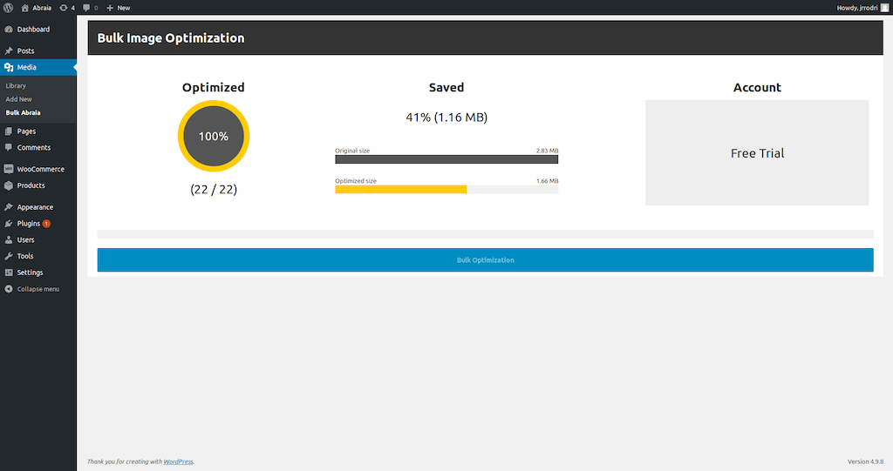

# Abraia image optimization plugin for WordPress

Automatically optimize images in your WordPress and Woocommerce site to speed
up you web site for any device with a perfect balance between quality and file
size.

## Description

Resize and compress all your JPEG and PNG images in WordPress with the best
parameters for each image based on its contain. It integrates the [Abraia
services](https://abraia.me) to provide the best in class [image optimization](
https://abraia.me/docs/image-optimization) technology.

### Features

- Optimize all your images in one click.
- Optimize your images using advanced content-aware technology.
- Automatically scale large images
- Process JPEG, PNG, and WebP image files.
- Manually optimize images in the media library.
- Automatically optimize images on upload.

<!-- - Set maximum width and height and large images will automatically scale before being added to your media library.
- Optimize any image in any directory.
- Asynchronously auto-smush your attachments for super fast compression on upload.
- View advanced compression stats per-attachment and library totals. -->

Install the [Abraia WordPress plugin](
https://github.com/abraia/abraia-wordpress/archive/v0.4.3.zip) now and start
optimizing images for free.

## Installation

1. Download the [last version of the plugin](
https://github.com/abraia/abraia-wordpress/archive/v0.4.3.zip).
2. Install it via Plugins > Add New > Upload Plugin.
3. Activate it and configure your API Keys to get everything
working.

## Bulk optimization

Go to the media library and select `Bulk Abraia` to automatically optimize all
your images.

## Manual optimization

Also, you can manually optimize every JPEG and PNG image from the right column
in the grid mode from the `Media Library`. Just press the button the individual
button or select several images to compress them with the bulk option.

## Contact us

Got questions or feedback? Let us know! Contact us at
[contact@abraiasoftware.com](mailto:contact@abraiasoftware.com).

## License

This software is licensed under the GPLv2 License. [View the license](LICENSE).
